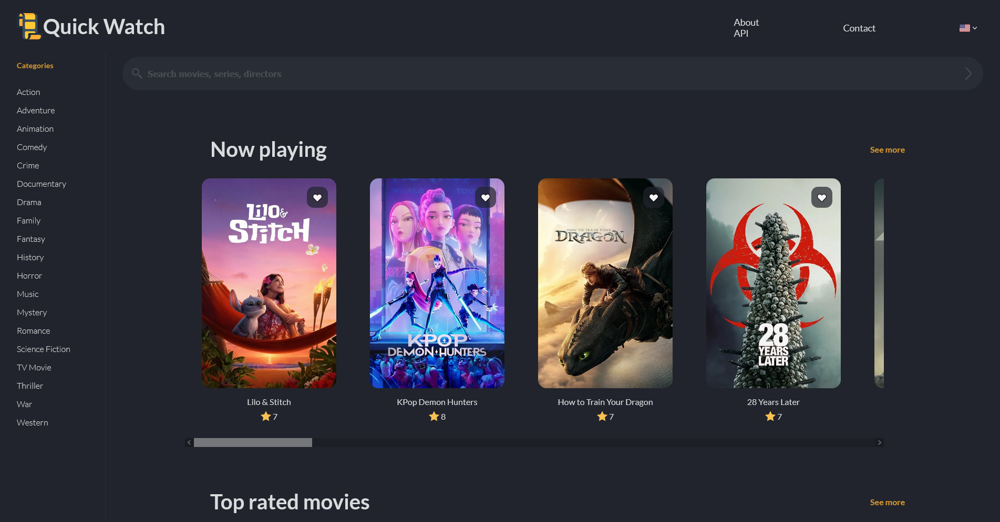

# Quick watch 🎬
In this project I design and developed a movie and TV show catalog that allowed me to practice fetching and displaying dinamic data from an external API.

---

## Screenshot

---

## Live Demo

- Live Site: https://devnielote.github.io/quick-watch/#

---

## Project Purpose

- Practicing integration with third-party APIs to fetch dynamic content
- Implementing a clean, user friendly interface with CSS variables and responsive design
- Enhancing skills in asynchronous JavaScript and API data handling
- Build interactive UI elements such as search bars, category filters, and detail views

---

## Built with

- HTML5
- CSS3
- JavaScript (ES6+)
- Axios
- 
